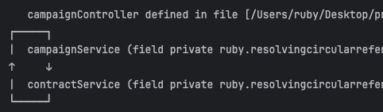

# Facade Pattern 을 통한 순환 참조 해결
어느날, 회사에서 운영중인 프로젝트의 Spring Boot 버전을 2.3.4 에서 2.7.18 로 결정하였습니다. 
그러나 버전을 올리고 애플리케이션을 실행하자마자 순환 참조 문제가 발생하면서 실행이 중단되었습니다.
알고보니 Spring Boot 2.6 버전부터 기본적으로 순환 참조를 금지하도록 변경된 것이었습니다.

## 순환 참조란?
순환 참조는 두 개 이상의 객체 또는 컴포넌트가 서로를 참조하면서, 종속 관계가 **순환 구조**를 이루는 상황을 말합니다. 
즉, A 객체가 B 객체를 참조하고, B 객체가 다시 A 객체를 참조하는 구조입니다.
의존성 방향이 양방향으로 설계된 경우로 서로 밀접하게 결합되기 때문에 서로 간의 변경에 의한 영향이 미칠 가능성이 높아집니다.
또한 의존 방향이 일정하지 않기 때문에 코드 추적이 어려워지기도 합니다.

- 여러 로직이 존재하는 실무에서는 A -> B -> A -> B .... 등으로 흐름이 꼬여 문맥 파악이 어려워 질 수 있다. 
    이는 유지보수 측면에서 큰 손해를 발생시킨다.

## spring.main.allow-circular-references
앞서 언급했듯이 Spring Boot 2.6 버전부터 기본적으로 순환 참조를 금지되었기 때문에 순환 참조 발생시 별도의 조치가 필요합니다.
그 중 하나가 spring.main.allow-circular-references 의 설정값을 true 로 지정하는 것입니다.
```yaml
spring:
  main:
    allow-circular-references: true
```
설정 값을 true 지정하면 프로젝트 내에서 순환참조가 발생하더라도 애플리케이션이 중단되지 않게 됩니다.
단, 이 경우에 생성자를 통한 Bean 주입은 사용할 수 없으며 근본적으로 문제를 해결한 것은 아니라 권장하는 방법은 아닙니다.
