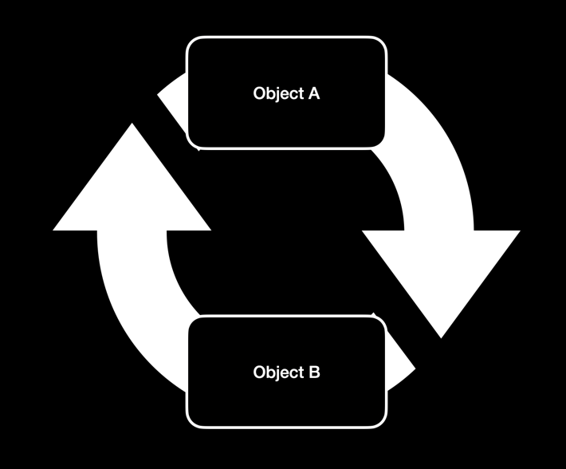
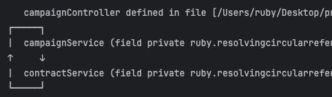
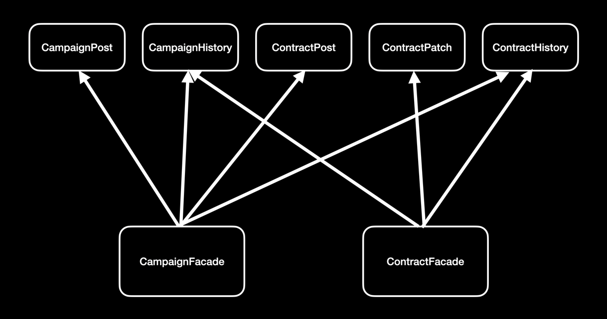

# Facade Pattern 을 통한 순환 참조 해결
어느날, 회사에서 운영중인 프로젝트의 Spring Boot 버전을 2.3.4 에서 2.7.18 로 결정하였습니다. 
그러나 버전을 올리고 애플리케이션을 실행하자마자 순환 참조 문제가 발생하면서 실행이 중단되었습니다.
알고보니 Spring Boot 2.6 버전부터 기본적으로 순환 참조를 금지하도록 변경된 것이었습니다.

---

## 목차
1. [순환 참조란?](#1-순환-참조)
2. [Spring Boot와 순환 참조 문제](#2-Spring-Boot와-순환-참조-문제)
3. [기존 코드의 순환 참조 문제](#3-기존-코드의-순환-참조-문제)
4. [Facade 패턴의 적용](#4-facade-패턴의-적용)
5. [적용 결과 및 주요 장점](#5-적용-결과-및-주요-장점)

---

## 1. 순환 참조
순환 참조는 두 개 이상의 객체 또는 컴포넌트가 서로를 참조하면서, 종속 관계가 **순환 구조**를 이루는 상황을 말합니다.



의존성 방향이 양방향으로 설계된 경우로 서로 밀접하게 결합되기 때문에 서로 간의 변경에 의한 영향이 미칠 가능성이 높아집니다.
여러 로직이 존재하는 실무에서는 A -> B -> A -> B .... 등으로 흐름이 꼬여 문맥 파악이 어려워 질 수 있으며, 이는 유지보수 측면에서 
큰 손해를 발생시키게 됩니다.

---

## 2. Spring Boot와 순환 참조 문제
앞서 언급했듯이 Spring Boot 2.6 버전부터 기본적으로 순환 참조를 금지되었기 때문에 순환 참조 발생시 별도의 조치가 필요합니다.
그 중 하나가 다음 설정을 추가하는 것입니다.
```yaml
spring:
  main:
    allow-circular-references: true
```
설정 값을 true 지정하면 프로젝트 내에서 순환참조가 발생하더라도 애플리케이션이 중단되지 않게 됩니다.
단, 이 경우에 생성자를 통한 Bean 주입은 사용할 수 없으며 근본적으로 문제가 해결된 것은 아니므로 권장하는 방법은 아닙니다.

---

## 3. 기존 코드의 순환 참조 문제
```kotlin
@Service
class CampaignService{
    @Autowired
    private lateinit var campaignRepository: CampaignRepository
    @Autowired
    private lateinit var campaignHistoryRepository: CampaignHistoryRepository
    @Autowired
    private lateinit var contractRepository: ContractRepository
    @Autowired
    private lateinit var contractService: ContractService

    @Transactional
    fun post(campaignPost: CampaignPost) {
        // ...

        contracts.forEach { contractService.post(it, campaign) }
    }

    @Transactional
    fun patch(id: Long, campaignPatch: CampaignPatch) {
        // ...
        
        contracts.forEach { contractService.postHistory(it) }
    }
}

@Service
class ContractService{
    @Autowired
    private lateinit var contractRepository: ContractRepository
    @Autowired
    private lateinit var contractHistoryRepository: ContractHistoryRepository
    @Autowired
    private lateinit var campaignService: CampaignService

    @Transactional
    fun patch(id: Long, contractPatch: ContractPatch) {
        // ...
        
        campaignService.postHistory(campaign)
    }
}
```
위의 코드를 보면 CampaignService 에서 청약(Contract) 의 등록 및 이력 등록을 추가로 처리하기 위해 ContractService 를 참조하고 있습니다.
또한, ContractService 에서도 캠페인(Campaign) 의 이력을 등록하기 위해 CampaignService 을 참조하고 있어 순환 참조가 발생하고 있습니다.



이런 상황을 해결하기 위해서 참조하는 목적인 청약의 등록과 이력 등록, 캠페인의 이력 등록 부분을 다른 클래스로 분리하여,
CampaignService 와 ContractService 에서 참조하면 되지 않을까라는 생각이 들었습니다.

---

## 4. Facade 패턴의 적용
### Facade 패턴이란?
**Facade 패턴**은 소프트웨어 설계에서 구조적 디자인 패턴 중 하나로, 복잡한 서브시스템을 단순화하여 사용자와의 인터페이스를 단순하게 제공하는 역할을 합니다. 
이를 통해 클라이언트는 서브시스템의 세부 사항을 알 필요 없이 단순화된 인터페이스만 사용할 수 있습니다.



```kotlin
@Component
class CampaignFacade(
    private val campaignRepository: CampaignRepository,
    private val contractRepository: ContractRepository,
    private val campaignPostService: CampaignPostService,
    private val campaignHistoryService: CampaignHistoryService,
    private val contractPostService: ContractPostService,
    private val contractHistoryService: ContractHistoryService
){
    @Transactional
    fun post(campaignPost: CampaignPost) {
        val contracts = campaignPost.contracts
        val campaign = campaignPostService.post(campaignPost)

        campaignHistoryService.postHistory(campaign)

        contracts.forEach {
            val contract = contractPostService.post(it, campaign)
            contractHistoryService.postHistory(contract)
        }
    }


    @Transactional
    fun patch(id: Long, campaignPatch: CampaignPatch) {
        val campaign = campaignRepository.findByIdOrNull(id) ?: throw RuntimeException("campaign not found")
        campaign.let {
            it.name = campaignPatch.name
            it.increaseVersion()
        }

        campaignHistoryService.postHistory(campaign)

        val contracts = contractRepository.findByCampaign(campaign)
        contracts.forEach {
            it.increaseVersion()
            it.campaignVersion = it.campaign.version
        }

        contracts.forEach { contractHistoryService.postHistory(it) }
    }
}

@Component
class ContractFacade(
    private val contractRepository: ContractRepository,
    private val campaignHistoryService: CampaignHistoryService,
    private val contractPatchService: ContractPatchService,
    private val contractHistoryService: ContractHistoryService
){
    @Transactional
    fun patch(id: Long, contractPatch: ContractPatch) {
        val contract = contractPatchService.patch(id, contractPatch)

        val contracts = contractRepository.findByCampaign(contract.campaign)
        contracts.forEach {
            it.increaseVersion()
            it.campaignVersion = it.campaign.version
        }

        contracts.forEach { contractHistoryService.postHistory(it) }

        val campaign = contract.campaign
        campaign.run {
            startDate = contracts.minOf { it.startDate }
            endDate = contracts.maxOf { it.endDate }
            amount = contracts.sumOf { it.amount }
        }
        campaignHistoryService.postHistory(campaign)
    }
}
```
기존의 CampaignService 와 ContractService 를 각각 CampaignFacade, ContractFacade 로 변경하고 내부의 작은 기능들을 외부 클래스로 분리하여 
참조하도록 변경하였습니다. 'Facade 클래스 -> 각 기능별 클래스' 로 의존성이 단방향으로만 이루어지게 됩니다.

---

## 5. 적용 결과 및 주요 장점

### 결과
- `CampaignService`와 `ContractService` 간 순환 참조 문제 완전히 해결.
- Spring Boot 2.6+ 환경에서도 **애플리케이션 정상 실행** 가능.

### 주요 장점
1. **결합도 감소:**  
   - 서비스 간 직접적인 의존 제거로 코드 변경에 유연해짐
2. **유지보수성 향상:**  
   - 새로운 기능 추가 시 특정 서비스 클래스를 수정하지 않고도 확장 가능
3. **테스트 용이성 증가:**  
   - Facade 단위로 테스트 가능 -> 서비스 테스트가 독립적
4. **설계 개선:**  
   - Facade를 통해 각 서비스가 수행하는 역할이 더 명확해짐
